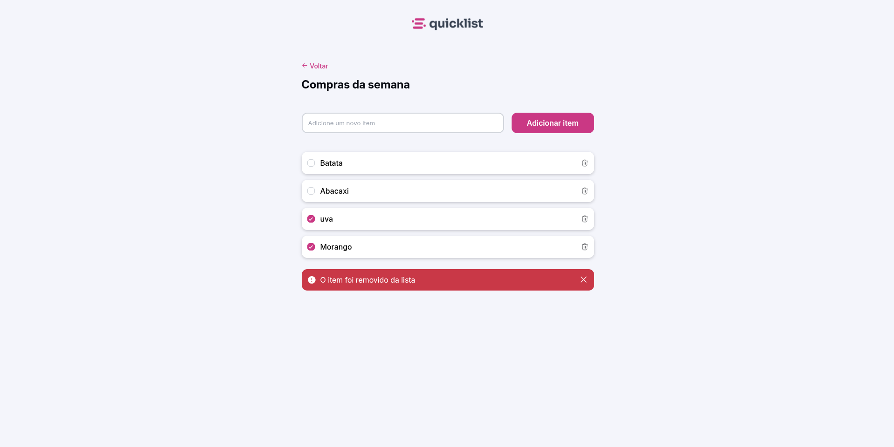

# QUICK LIST

Primeiro projeto desenvolvido com JavaScript, é possivel utilizalo como listas de compras para mercado, a aplicação conta com sistema de salvamento no local storage do dispositivo.

## Tecnologias

* HTML
* CSS
* JavaScript

## Autor
[Gabriel Lacerda](<https://www.linkedin.com/in/gabriellacerda1005/>)